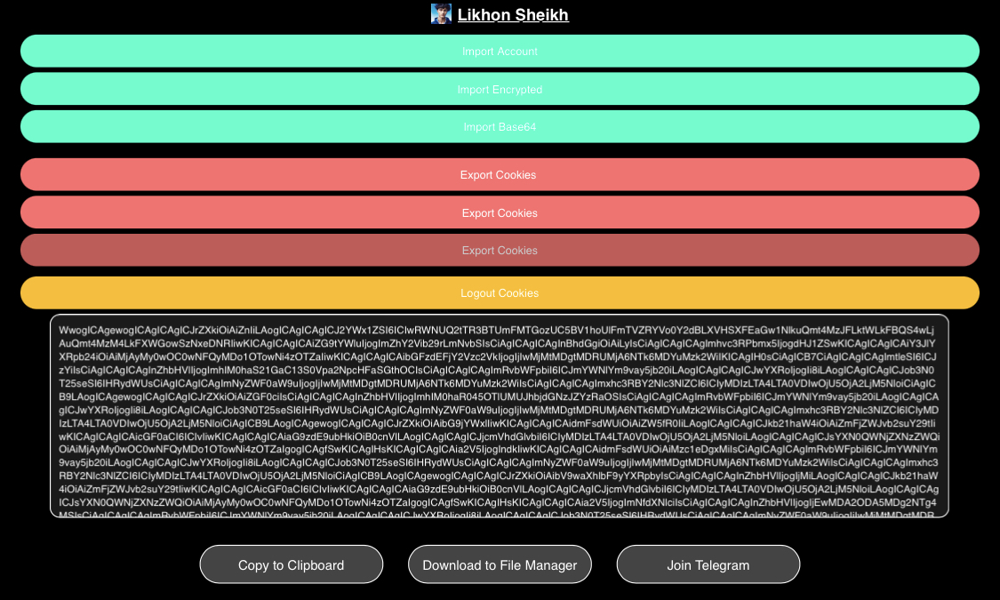

# **Facebook Bot V1**  

  

This Chrome extension **Facebook Bot V1** is your solution to automate bot logins. Import/export fbstate.json and cut down on manual work and enhance productivity. 🚀

  

## 🌟 Features

- 📂 Import/Export fbstate.json for bot login.
- 🕹️ User-friendly interface.
- ⚙️ Quick access right from your browser.

## ⚡ Installation

1. 📥 Download the latest release from our GitHub Releases.
2. 📂 Unzip the downloaded file to your preferred location.
3. 🌐 Go to chrome://extensions in your browser to open the Extension Management page, or click on Extensions under Settings.
4. 🚀 Enable Developer Mode by toggling the switch at the top right.
5. ⚙️ Click the LOAD UNPACKED button and select the unzipped extension directory.

## 🛠️ Usage

- 🔍 Click on the Facebook Bot V1 icon in your browser after installing the extension.
- 💡 Select either the import or export option, depending on your need.
- 🔄 For import, provide the fbstate.json file. For export, you will receive the fbstate.json file.

## 🖐️ Contributing

We welcome contributions from the community! If you'd like to contribute:

1. 🍴 Fork the project.
2. 🌲 Create your feature branch: git checkout -b feature/AmazingFeature
3. 💾 Commit your changes: git commit -m 'Add some AmazingFeature'
4. ⬆️ Push to the branch: git push origin feature/AmazingFeature
5. 📮 Submit a pull request.

## 📜 License

This project is licensed under the MIT License. See the LICENSE file for details.

Manage your Facebook bots effortlessly with **Facebook Bot V1**. Try it out today! 🎉
